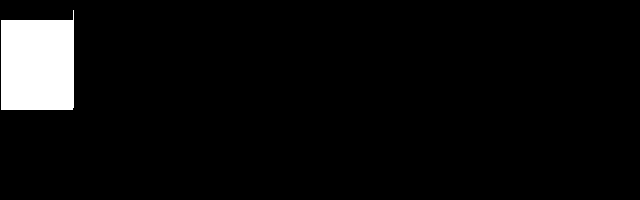
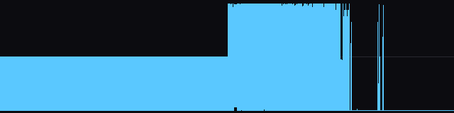

# Dance eJay 1 + 2 Static Recompilation

Static recompilation of **Dance eJay** (PXD Musicsoft / Fast Trak, 1997) and
**Dance eJay 2** (1998–99) — the loop-and-drop dance studio that taught a
generation of teenagers what a bar was — from their shipping binaries to
native C.

Both are Visual Basic front ends bolted onto a small, fast, hand-written
audio engine. The engine is the part worth having, and it is the part that
survived the version jump intact.

Built on the [pcrecomp](https://github.com/sp00nznet/pcrecomp) toolchain,
alongside the same-era Win16/Win32 arc of DinoPark Tycoon (1993), El-Fish
(1993), Catz (1996) and Operation Neptune (1998).

## Status

**It plays, and it draws.** The 1997 engine initialises, decodes its intro
sample, streams it to a real sound card at 22,050 Hz, and animates its playback
cursor in a window - at the same time, out of recompiled 16-bit machine code.


*The 1997 interface with the recompiled engine behind it: the playback cursor
stepping across the eight-track grid while the intro streams to the sound card.
The background is loaded at runtime from the user's own disc with `--bg`.*



*The engine's entire user interface: a one-pixel cursor stepping across the
sample strip, drawn through its single `BitBlt` import. Everything else Dance
eJay draws lives in `DANCE.EXE`, which is VB4 p-code and cannot be lifted.*



*Amplitude envelope of `INTRO.PXD` after the engine decoded it - 5.94 seconds
of 8-bit 22 kHz audio, captured with `--wav` straight out of the buffers handed
to `waveOutWrite`. It is decoded, not copied: no window of this output appears
anywhere in the source file.*

```
build-trace/ejay.exe --dir original/ejay1/DANCE/DMACHINE ^
    AInit:1 ADevice:d:0 AStart:d:2000000 InterStart:d:0 ^
    ABilder:d:1,d:0,d:0,d:640,d:0,d:10,d:100 ^
    --pump 5000 --wav work/intro.wav --window --shot docs/img/cursor.bmp
```

`ADevice` before `AStart` is the part that took longest to find: without it the
device never opens and the engine mixes silence for ever.

The **sampler** path - placing samples on the timeline and playing through them
- is still silent. See [ENGINE](docs/ENGINE.md) for exactly where it stops.

**The 1997 engine initialises and runs.** `DANCE02.DLL` is lifted whole -
30,904 bytes of 16-bit machine code into 1,244 C functions - `LibMain`
succeeds, and `AInit` executes 2,822 lifted functions on its way through the
engine's startup into `InterStart`.

```
LibMain returned ax=0001

  AGetTime  ax=0000
  AGetFree  ax=0000
  AGetFull  ax=0000
  AInit     ax=0000     runs 2,822 lifted functions, reaches InterStart
  ADevice   ax=0003     the number of wave-out devices on this machine
```

`ADevice` counts the host's real audio devices, so control crosses the whole
stack: lifted 1997 code, the Win16 shim, Win32. 56 of the 60 imports are
implemented, including the whole waveOut/waveIn/aux surface, and every call
returns with the stack exactly balanced.

Nothing is audible yet, but the path is mapped end to end.
[ENGINE](docs/ENGINE.md) has it: the engine has **two clocks** and the waveOut
path hangs off the one the host was meant to call; `APlay` is a multiplexed
command whose values from 3 up are sample slots; and the `.PXD` load happens on
the timer tick, not in `APlay`. Triggering a voice and pumping the clock makes
the engine build a sample path for itself and try to open it.

`AWaveDauer` already reads a real sample off the disc - 270 bytes of header,
magic `tPxD` - and answers with a duration.

| | |
|---|---:|
| Code lifted | 30,904 of 30,904 bytes - **100%** |
| Functions | 1,244 |
| Entry points recovered by name | 33 of 34 |
| Argument sizes recovered | 33 of 34 |
| Win16 imports implemented | 56 of 60 |
| Unresolved call targets | 1 |

The four unimplemented imports are `sndPlaySound` and the three absolute-value
imports, which are patched into the code stream and never called. The one
unresolved call target is `___EXPORTEDSTUB`, a Borland helper nothing calls.

### Two bugs worth naming

Both were silent, and both were found by making the harness check something
rather than by reading code.

**Half the far calls went to the wrong place.** A far call in an NE binary can
carry either of two fixups, and they do not mean the same thing: a `FAR_PTR`
fixup supplies offset *and* segment, while a `SELECTOR` fixup patches only the
segment word and leaves the offset in the instruction. The lifter took the
relocation's offset for both, and a `SELECTOR` relocation reports offset 0 - so
**154 of 319 far calls** jumped to offset 0 of the code segment. That is a real
function, so they ran and returned instead of crashing, and `LibMain` reported
success the whole time. `AInit` was three such calls and a return.

**72 constants were fixup chain links.** `__AHINCR` and `__AHSHIFT` are not
routines: the loader patches a value into the code stream at every site. Left
alone, each site keeps what the file held, which for a chained fixup is the
offset of the *next* site - a small, plausible number. `add ax, __AHINCR`,
which walks a huge pointer to the next 64 KB tile, was adding 0x1B96 tiles.
Nothing would have shown it until the first sample larger than 64 KB, which is
every sample worth playing.

The stack-balance check in the harness came out of the same instinct and
immediately caught the test itself calling three exports with an empty stack.

## The finding

`DANCE02.DLL` (1997, 16-bit NE) exports 31 functions. `PXD32D4.DLL` (1999,
32-bit PE) exports 87. **27 of the 31 are the same names.**

```
ABilder  ABildpos  ADevice  AEnd     AExport   AGetFree  AGetFull  AGetTime
AInit    ALautGet  ALautSet APlay    ARecInit  ARecInput ARecPlay  ARecStart
ARecStop ARecTimer ASortIn  ASortInit ASortOut ASortStart ASortStart2
AStart   AStop     ATimer   AWaveDauer
```

eJay 1 and eJay 2 are not two engines that resemble each other. They are one
engine, ported 16-bit to 32-bit and then grown by sixty functions. That is the
whole reason to do these two together: **every shared function gets lifted
twice, from two independent compilers, and the two results check each other.**

The names are German — *Laut* volume, *Bild* picture, *Welle* wave, *Pegel*
level, *Dauer* duration, *Fenster* window, *Takt* beat — because the DLL says
who wrote it, right there in its own name table: *"DanceMachine Audio-DLL
Copyright B. Throll, THROLL GmbH, Germany."* We get most of a symbol table for
free.

## What we are actually working with

| | Dance eJay (1997) | Dance eJay 2 (1998–99) |
|---|---|---|
| Front end | `DANCE.EXE`, VB4 **16-bit p-code** | `Dancejay.exe`, VB5 **native x86** |
| Audio | `DANCE02.DLL`, 30,904 B of 16-bit code | `PXD32D4.DLL`, 120,700 B of 32-bit code |
| Graphics | VB forms + `MCI.VBX`, `CMDIALOG.VBX` | `PXD32CL1.DLL`, 23 `GFX_*` exports |
| Load/save | in the forms | `PXD98DB.DLL`, 22 exports |
| Liftable? | DLL yes, EXE **no** | all of it |

The asymmetry matters. `DANCE.EXE` imports exactly one module — `VB40016` — and
carries 216 relocations across 212 KB. It calls no Windows API. VB4 for 16-bit
had no native compiler, so those seventeen discardable segments are p-code, and
`lift16` would turn them into confident garbage. `Dancejay.exe` is the opposite
case: a genuine VB5 native build, 1.27 MB of real x86, 190 `__vba*` imports —
liftable, with the whole VB runtime to answer.

## Roadmap

Each phase ends with something that runs, not something that compiles.

**Phase 1 — `DANCE02.DLL`, the 1997 engine.**
One code segment, one data segment, small model, 313 relocations, 34 named
entry points. `ne_decode` → `lift16`. The harness is a C host that opens a
`.PXD`, calls `AInit`, `ADevice`, `AStart`, `APlay` through lifted code, and
routes `MMSYSTEM` to real `waveOut`. Done when a sample from the 1997 disc is
audible out of recompiled 1997 machine code.

**Phase 2 — the `.PXD` format.**
Written down from the lifted decoder rather than from a hex editor. eJay 1's
samples and eJay 2's `DJ2DG*.PXD` cross-check the result — the same loader
should eat both, and any place it does not is where the format changed.

**Phase 3 — `PXD32D4.DLL`, the 1999 engine.**
`disasm32` → `lift32`, 87 exports pre-named. The same harness, 32-bit. Every
one of the 27 shared functions is now lifted twice from two compilers; where
the two disagree, one of them is wrong, and that is the cheapest bug-finder
this project will ever get.

**Phase 4 — `PXD32CL1.DLL` and `PXD98DB.DLL`.**
The sample grid, the volume bars, the intro; then the load/save layer and the
`.SCT` song format. `GFX_*` draws through `CreateDIBSection` + `BitBlt`, which
is the same shim shape Operation Neptune needed for WinG.

**Phase 5 — `Dancejay.exe`.**
`lift32` the whole 1.27 MB, and leave `MSVBVM50.DLL` **real** — the hybrid
boundary from [pcrecomp's HYBRID](https://github.com/sp00nznet/pcrecomp/blob/main/docs/HYBRID.md),
the same trick that put Encarta's app body in lifted code while MFC stayed
native. Answering 190 `__vba*` calls by hand is the alternative, and it is not
a better one. Also where `GetVolumeInformationA` gets told the CD is present.

**Phase 6 — the eJay 1 front end.**
Not a lift. Decode the VB4 p-code and the form definitions into structured
data, and drive the Phase 1 engine from a rebuilt UI. eJay 1's forms are named
in its string table already: `Dancemix`, `DanceMachine`, `LoadSave`,
`Funktion`, `DMSETUP`.

Phases 1–3 are the spine. If this project only ever ships those, it has still
recovered the engine.

## Layout

```
original/       your copies of the two discs (gitignored — see Legal)
  ejay1/          Dance eJay
  ejay2/          Dance eJay 2
docs/           RECON, and the format notes as they land
tools/          project-specific scripts; the toolchain lives in ../tools
src/engine/     the runtime: CPU model, import bridges, waveOut shim
src/recomp/gen/ generated C (regenerated, not committed)
scripts/        build.ps1
extracted/      extracted assets (regenerated, not committed)
work/           scratch analysis output
```

`../tools` is a checkout of [pcrecomp](https://github.com/sp00nznet/pcrecomp),
the same sibling layout the other pcrecomp-family projects use.

## Building

MinGW-w64 GCC, CMake, Ninja, and Python 3 with `capstone` and `pefile`. IDA is
optional but does two jobs nothing else here can: it resolves all 60 Win16
import ordinals to real API names, and it gives byte-accurate instruction heads
so the sweep cannot desync on data-in-code.

```bash
cp original/ejay1/DANCE/DMACHINE/DANCE02.DLL work/

py -3.11 tools/ida_export.py work/DANCE02.DLL work/ida_funcs.json   # optional
python tools/lift_dance02.py        # 30,904 bytes -> 1,244 C functions
python tools/gen_image.py           # flat memory image + segment layout
python tools/gen_exports.py         # the 34 named entry points
python tools/gen_win16_stubs.py     # the import surface
python tools/gen_segments_h.py
python tools/gen_dispatch.py
python tools/gen_stubs.py

cmake -S . -B build -G Ninja -DCMAKE_C_COMPILER=gcc
cmake --build build

build/ejay.exe --dir original/ejay1/DANCE/DMACHINE            # LibMain + export list
build/ejay.exe --dir original/ejay1/DANCE/DMACHINE ALautGet   # call one
python tools/test_engine.py                                   # the smoke test
```

The lift takes about a minute; the build, a couple more.

`-O2` is a correctness requirement, not a preference: the lifter turns every
intra-segment jump into `target(cpu); return;`, so a guest loop spanning lifted
functions is host recursion, and only sibling-call optimisation turns it back
into a loop.

## Reproducing the recon

Python 3.10+ with `capstone` and `pefile`, and your own copies of the discs
in `original/`:

```bash
# The 1997 engine: segments, relocations, 34 named entry points
python ../tools/tools/ne/ne_parse.py original/ejay1/DANCE/DMACHINE/DANCE02.DLL

# The 1997 front end: one imported module, and why that settles it
python ../tools/tools/ne/ne_parse.py original/ejay1/DANCE/DMACHINE/DANCE.EXE

# The 1999 engine, and the two DLLs beside it
python ../tools/tools/pe/pe_analyze.py original/ejay2/D_ejay2/ejay/PXD32D4.DLL
python ../tools/tools/pe/pe_analyze.py original/ejay2/D_ejay2/ejay/PXD32CL1.DLL
python ../tools/tools/pe/pe_analyze.py original/ejay2/D_ejay2/ejay/PXD98DB.DLL

# The VB5 front end
python ../tools/tools/pe/pe_analyze.py original/ejay2/D_ejay2/ejay/Dancejay.exe
```

Nothing builds yet. This section grows as the phases land.

## About the screenshots

The images above show this project running, to record that it works. Dance eJay
and its interface artwork are the property of their rights holders - PXD
Musicsoft / Fast Trak / eJay AG - and nothing here claims otherwise, nor is any
of it redistributed: the background is read at runtime from a disc you supply,
and the repository contains no application files. Same posture as the other recomp
projects here.

## Legal

No application files are included. Dance eJay is © 1997 and Dance eJay 2 © 1998–1999
PXD Musicsoft Inc. / Fast Trak / eJay AG; the audio DLLs are © Bernhard Throll
/ THROLL GmbH. All long out of print, all still in copyright as far as anyone
can tell. Bring your own discs.

The code in this repository is MIT licensed. See [LICENSE](LICENSE).
