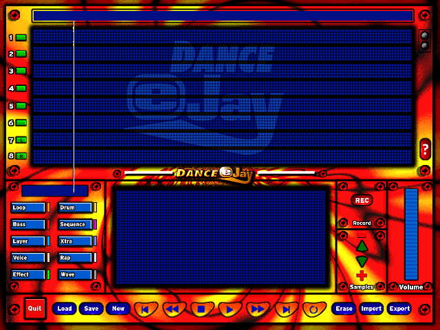
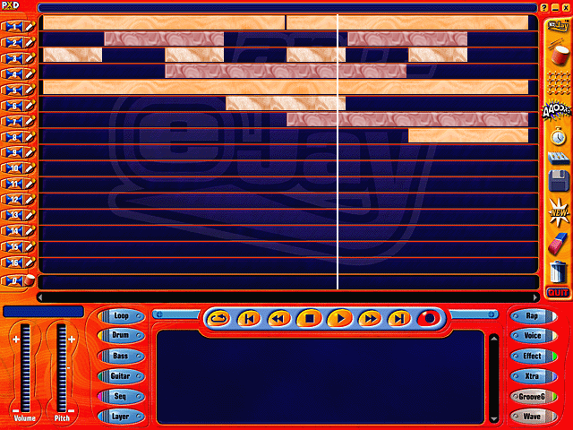
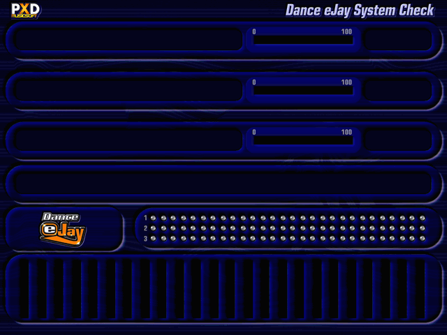
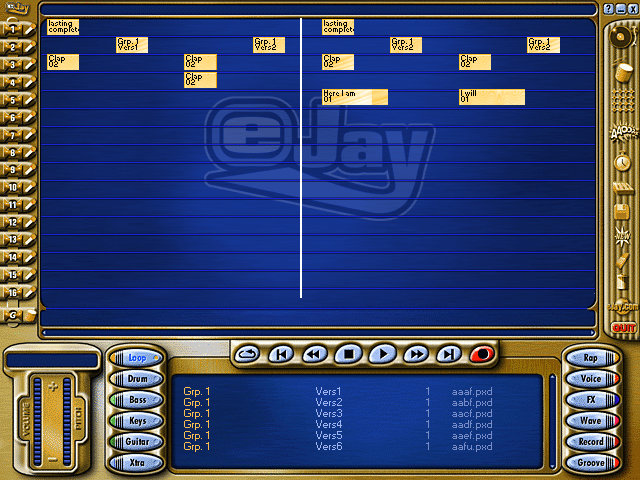

# Dance eJay 1 + 2 Static Recompilation

Static recompilation of **Dance eJay** (PXD Musicsoft / Fast Trak, 1997) and
**Dance eJay 2** (1998–99) — the loop-and-drop dance studio that taught a
generation of teenagers what a bar was — from their shipping binaries to
native C.

Both are Visual Basic front ends bolted onto a small, fast, hand-written
audio engine. The engine is the part worth having, and it is the part that
survived the version jump intact.

Built on the [pcrecomp](https://github.com/sp00nznet/pcrecomp) toolchain,
alongside the same-era Win16/Win32 arc of DinoPark Tycoon (1993), El-Fish
(1993), Catz (1996) and Operation Neptune (1998).

## Status

**Alpha, unreleased, no tag yet.** Dance eJay 2's host is usable if you have the
discs - it draws the arrangement page and plays an arrangement in time. Dance
eJay 1's engine is recompiled and streams audio, but its sampler path is still
silent. Neither is something you can install; both need your own copy of the
application beside them. [ROADMAP](ROADMAP.md) is what is next,
[CHANGELOG](CHANGELOG.md) is what has landed.

Format conformance against a local Dance eJay 1 + 2 install: **5,834 passed,
8 failed**, the eight known and listed under Getting Started.

**It plays, and it draws.** The 1997 engine initialises, decodes its intro
sample, streams it to a real sound card at 22,050 Hz, and animates its playback
cursor in a window - at the same time, out of recompiled 16-bit machine code.



*The 1997 interface with the recompiled engine behind it: the playback cursor
stepping across the eight-track grid while the intro streams to the sound card.
The background is loaded at runtime from the user's own disc with `--bg`.*

```
build-trace/ejay.exe --dir original/ejay1/DANCE/DMACHINE ^
    AInit:1 ADevice:d:0 AStart:d:2000000 InterStart:d:0 ^
    ABilder:d:1,d:0,d:0,d:640,d:0,d:10,d:100 ^
    --pump 5000 --wav work/intro.wav --window --shot docs/img/cursor.bmp
```

`ADevice` before `AStart` is the part that took longest to find: without it the
device never opens and the engine mixes silence for ever.

The **sampler** path - placing samples on the timeline and playing through them
- is still silent. See [ENGINE](docs/ENGINE.md) for exactly where it stops.

### Dance eJay 2 is up: the workspace, with sound

The 1999 pair - `PXD32D4.DLL` for audio, `PXD32CL1.DLL` for graphics - run under
`host32/ejay2.exe`, driven in the order the shipping program uses, into a window
of ours.



*Dance eJay 2's arrangement page, playing. Thirteen samples are placed across
the tracks with `APlay` and drawn into the same lanes by `PXD32CL1.DLL` from the
same list, so what is on the screen is what is coming out of the speakers - the
playhead is where the engine says it is, a bar every 1.714 seconds. The
block labels and the browser rows are the samples' own two-line names, read out
of their file headers - "Snare Beat / Risk", "Perc.L / Vers10", "Warm** /
Line 1".*

Three pieces, all of them real code:

- **The page.** `SEITEN`, eJay's own layout file, calls this one `:Hauptbild`
  and gives it `EJAY01` and `EJAY02`. `ALoad` opens the bitmap, LZ-decompresses
  it if it starts with `SZDD`, builds a DIB section and hands back a live device
  context - so the graphics DLL is never given a file, and neither are we.
- **The blocks.** `GFX_SampleInit` builds the grid and returns its memory DC;
  `GFX_SampleAddTexturePair` registers each block style from a texture pair and
  a palette off the disc, returning the index to draw it with; `GFX_SampleZeichne`
  renders one block into that DC at a width in pixels, and the caller blits it
  into a lane. The order is the trap - `SampleInit` zeroes the entry count, so
  registering textures before it throws them away and every draw silently
  returns zero.
- **The sound.** Two paths, and they are not interchangeable.

  `DPlayFile(path, 0, channel)` after `AFenster(hwnd)` → `DStart(0)` **previews one
  sample**. `METRO.PXD` - which is a plain RIFF WAV despite the extension -
  comes out as a metronome. `DINTRO.PXD` is a mix, not a sample, and handing it
  over gets its bytes rendered as PCM, which is static.

  The **song** path is `APlay` per placed sample, then `AStart`, then `RTimer`
  on a clock:

```
ASetPfad(dir) → AStop → AMitte(0,0) → RWaveParam(60, 0x6666) → ASetFader(0,0)
  → APlay(0,0,0,0,0, &status, file, track, bar*88200, 0,0, 0x100)  per sample
  → AFenster(hwnd) → DStart(0) → AStart(0xA17FC0)
  then RTimer() every frame
```

  `RTimer` is the piece that took longest to find. **`ATimer` is a stub in this
  engine** - `mov eax, 1; ret`, the whole function - because the work moved onto
  an audio thread in 1999. But the thread only arms the mixer when it is allowed
  to, and `RTimer` is the same routine it calls to do it. Without `RTimer` on a
  clock the mixer never arms, the engine never fills its DirectSound buffer, and
  what plays is whatever was in that buffer already: full-scale noise that no
  volume setting touches, because the engine is not the one making it.

  `APlay`'s twelve arguments are in [EJAY2](docs/EJAY2.md); the ones that matter
  are 8 (track), 9 (start, in samples at 44,100 - `AStart`'s 0xA17FC0 is four
  minutes in the same unit) and 6 (a status word the engine writes into).

- **The library, and the browser.** eJay 2's samples ship on its second disc,
  which this one is not. eJay 1's are here, and the 1999 engine opens, decodes
  and plays a 1996 `tPxD` sample without being asked to do anything special
  about it - 1,352 of them.

  It does not have to be found by walking the disc, either: `DMACHINE\PXD.TXT`
  is the index - nine `(start, count)` pairs for the sound groups, then four
  fields per sample (size, length in bars, and the two lines of its name) - and
  `MAX.TXT` is the matching list of paths. The two name fields are exactly the
  pair `GFX_SampleZeichne` wants for a block label, and the bar count is the
  block's width, so one record feeds both the browser row and the grid.

  The browser works from it: the category buttons switch sound group, the wheel
  and the scroll strip move the list, a click selects, and a double click places
  the sample - into the first lane with room at the bar the cursor is on, live,
  through `APlay`, and drawn into the grid in the same pass. Which is the
  gesture eJay's own tooltip describes: *"double click for play back of a
  sample, move a sample to one of the tracks"*. A block already in the grid
  drags along its lane, snapped to the bar; dropping it rebuilds the arrangement
  in the engine, because `APlay` appends and there is no move.

- **The arrangement plays, in time.** Placing thirteen samples and getting a
  song out of them turned on one number, and it was wrong from the first
  `APlay`: 88,200 per bar, which is 120 BPM counted in samples. The engine
  counts **output bytes** - its transport dword advances 176,400 for every
  second of playback, 44,100 frames of 16-bit stereo - and Dance eJay's tempo is
  a fixed **140 BPM**, so a bar is 1.714 seconds and **302,400** of them. At
  88,200 a bar was half a second: sixteen bars of grid became eight, every
  block's end landed inside its own audio, and the whole arrangement fired and
  died in the first few seconds.

  The sample files say the same number themselves. A `tPxD` header carries the
  decoded length after the name and a `0x54` byte, as a byte count of 16-bit
  mono - 151,200, exactly one bar at 140 BPM, and 37,800, exactly one beat - so
  the host reads it out of the file and rounds it up to whole bars instead of
  trusting `PXD.TXT`'s bar-count field. A block placed at bar 12 now sounds at
  bar 12.0 on the engine's own clock, and a fourteen-bar arrangement plays
  through and stops where it ends.

- **The chrome responds.** `K_640` is eJay's control table - a name and ten
  numbers per control: where it sits, how big it is, and three source rectangles
  in `EJAY02` for its normal, rolled-over and pressed states. **Every number is
  in a 1280x960 space, so the 640x480 art set halves them** - which is why
  `B_EJAY` is listed at x 1216 with a width of 63 and still fits on a 640-pixel
  screen. Halve both and it is a 31-pixel button at x 608, hard against the
  right rail. 591 controls, and the buttons now light under the pointer and go
  down when clicked, out of eJay's own sheet.

```
host32/build.bat host32/ejay2.c host32/ejay2.exe
cd <the ejay folder>
ejay2.exe --song --lib <eJay 1 DANCE folder> --volume 3 --ticks 0
```

`--ticks 0` keeps the window up until you close it, which is the only way to
click anything. `--selftest` checks the browser's hit-testing and scroll clamp
without a mouse.

```
```

None of it was reachable until `Dancejay.exe` gave up its call sites. It is VB5
native, so it imports `MSVBVM50` and nothing else and appears never to touch
either DLL; `tools/vb_declares.py` recovers the 217 lazy-resolution thunks VB
emits instead and disassembles every call to them. That is where the start-up
order came from - `ATyp(3)` **before** `ADevice(0)` **before** `AInit(hwnd)`,
none of it the 1997 order - along with `ALoad`'s record layout, `ALautSet`'s
0..32768 exponential scale, and the fact that `ADevice` and `AInit` return **0
for success**, not failure. [EJAY2](docs/EJAY2.md) has the rest.

The start-up **system check** renders too, through the `GFX_Intro*` family:



*Dance eJay 2's loading screen, animating: three progress bars filling, the LED
matrix blinking, twenty-four VU segments moving, and its own text - all drawn by
`PXD32CL1.DLL` out of the bitmaps on the disc.*

**It runs.** The progress bars fill, the twenty-four VU segments move, the LED
matrix blinks, and the text reads *"Checking Soundsystem ... Completed"*.

Two things it wanted, and neither was a value to be fed:

- **Register the keys before the bitmaps.** `K_640` holds 58 `K_INTRO_*`
  entries and `GFX_IntroSetKey` files each one's rect by name. Do that before
  `GFX_IntroInitScreen` and the elements have geometry when the animation
  reaches them; do it after and the fill routine walks a zero rectangle, which
  is what the 92-second band past 0xd48 was - 24 BitBlts in 83 seconds, because
  the time went into a software pixel loop with nothing bounding it.
- **The copy surface has to be real, and 16-bit.**
  `GFX_IntroInitScreenCopy(hdc, w, h, bits)` bails if `bits` is null, before it
  stores the device context the animation blits from - so null is a crash
  waiting at t > 3400ms. And its blend loop ends `mov word ptr [edi], ax`,
  packing 5-6-5, so an 8bpp bitmap from `GRAFIKA` gives it half the buffer it
  thinks it has: it overruns, catches that in its own `__try`, and carries on
  drawing correctly while corrupting what follows. It wants a scratch 5-6-5 DIB
  the size of the screen.

And a retraction: `GFX_IntroRefresh(-1)` is **not** a first-time init. Its
dispatch checks the argument before the "started" byte, and the branch it
reaches switches every later call to the *ending* renderer - which is why
Dancejay calls it only in the loop before `GFX_IntroClose`. Driving it first is
what produced "no stall, black screen": the animation never ran.
[EJAY2](docs/EJAY2.md) has the rest.

Still to do: the transport buttons do not do anything yet beyond lighting up;
the status word `APlay` is handed never moves off 99 even though the sample
plays, so something is expected to read it that nothing here does; and the
loading screen still stalls, though it is now pinned down rather than mysterious
- see below.

**The 1997 engine initialises and runs.** `DANCE02.DLL` is lifted whole -
30,904 bytes of 16-bit machine code into 1,244 C functions - `LibMain`
succeeds, and `AInit` executes 2,822 lifted functions on its way through the
engine's startup into `InterStart`.

```
LibMain returned ax=0001

  AGetTime  ax=0000
  AGetFree  ax=0000
  AGetFull  ax=0000
  AInit     ax=0000     runs 2,822 lifted functions, reaches InterStart
  ADevice   ax=0003     the number of wave-out devices on this machine
```

`ADevice` counts the host's real audio devices, so control crosses the whole
stack: lifted 1997 code, the Win16 shim, Win32. 56 of the 60 imports are
implemented, including the whole waveOut/waveIn/aux surface, and every call
returns with the stack exactly balanced.

Nothing is audible yet, but the path is mapped end to end.
[ENGINE](docs/ENGINE.md) has it: the engine has **two clocks** and the waveOut
path hangs off the one the host was meant to call; `APlay` is a multiplexed
command whose values from 3 up are sample slots; and the `.PXD` load happens on
the timer tick, not in `APlay`. Triggering a voice and pumping the clock makes
the engine build a sample path for itself and try to open it.

`AWaveDauer` already reads a real sample off the disc - 270 bytes of header,
magic `tPxD` - and answers with a duration.

| | |
|---|---:|
| Code lifted | 30,904 of 30,904 bytes - **100%** |
| Functions | 1,244 |
| Entry points recovered by name | 33 of 34 |
| Argument sizes recovered | 33 of 34 |
| Win16 imports implemented | 56 of 60 |
| Unresolved call targets | 1 |

The four unimplemented imports are `sndPlaySound` and the three absolute-value
imports, which are patched into the code stream and never called. The one
unresolved call target is `___EXPORTEDSTUB`, a Borland helper nothing calls.

### Two bugs worth naming

Both were silent, and both were found by making the harness check something
rather than by reading code.

**Half the far calls went to the wrong place.** A far call in an NE binary can
carry either of two fixups, and they do not mean the same thing: a `FAR_PTR`
fixup supplies offset *and* segment, while a `SELECTOR` fixup patches only the
segment word and leaves the offset in the instruction. The lifter took the
relocation's offset for both, and a `SELECTOR` relocation reports offset 0 - so
**154 of 319 far calls** jumped to offset 0 of the code segment. That is a real
function, so they ran and returned instead of crashing, and `LibMain` reported
success the whole time. `AInit` was three such calls and a return.

**72 constants were fixup chain links.** `__AHINCR` and `__AHSHIFT` are not
routines: the loader patches a value into the code stream at every site. Left
alone, each site keeps what the file held, which for a chained fixup is the
offset of the *next* site - a small, plausible number. `add ax, __AHINCR`,
which walks a huge pointer to the next 64 KB tile, was adding 0x1B96 tiles.
Nothing would have shown it until the first sample larger than 64 KB, which is
every sample worth playing.

The stack-balance check in the harness came out of the same instinct and
immediately caught the test itself calling three exports with an empty stack.

## The finding

`DANCE02.DLL` (1997, 16-bit NE) exports 31 functions. `PXD32D4.DLL` (1999,
32-bit PE) exports 87. **27 of the 31 are the same names.**

```
ABilder  ABildpos  ADevice  AEnd     AExport   AGetFree  AGetFull  AGetTime
AInit    ALautGet  ALautSet APlay    ARecInit  ARecInput ARecPlay  ARecStart
ARecStop ARecTimer ASortIn  ASortInit ASortOut ASortStart ASortStart2
AStart   AStop     ATimer   AWaveDauer
```

eJay 1 and eJay 2 are not two engines that resemble each other. They are one
engine, ported 16-bit to 32-bit and then grown by sixty functions. That is the
whole reason to do these two together: **every shared function gets lifted
twice, from two independent compilers, and the two results check each other.**

The names are German — *Laut* volume, *Bild* picture, *Welle* wave, *Pegel*
level, *Dauer* duration, *Fenster* window, *Takt* beat — because the DLL says
who wrote it, right there in its own name table: *"DanceMachine Audio-DLL
Copyright B. Throll, THROLL GmbH, Germany."* We get most of a symbol table for
free.

## What we are actually working with

| | Dance eJay (1997) | Dance eJay 2 (1998–99) |
|---|---|---|
| Front end | `DANCE.EXE`, VB4 **16-bit p-code** | `Dancejay.exe`, VB5 **native x86** |
| Audio | `DANCE02.DLL`, 30,904 B of 16-bit code | `PXD32D4.DLL`, 120,700 B of 32-bit code |
| Graphics | VB forms + `MCI.VBX`, `CMDIALOG.VBX` | `PXD32CL1.DLL`, 23 `GFX_*` exports |
| Load/save | in the forms | `PXD98DB.DLL`, 22 exports |
| Liftable? | DLL yes, EXE **no** | all of it |

The asymmetry matters. `DANCE.EXE` imports exactly one module — `VB40016` — and
carries 216 relocations across 212 KB. It calls no Windows API. VB4 for 16-bit
had no native compiler, so those seventeen discardable segments are p-code, and
`lift16` would turn them into confident garbage. `Dancejay.exe` is the opposite
case: a genuine VB5 native build, 1.27 MB of real x86, 190 `__vba*` imports —
liftable, with the whole VB runtime to answer.

## Roadmap

The near-term list - what is being worked on now, and what is deliberately
deferred - is in [ROADMAP](ROADMAP.md). This is the longer arc: each phase ends
with something that runs, not something that compiles.

**Phase 1 — `DANCE02.DLL`, the 1997 engine.**
One code segment, one data segment, small model, 313 relocations, 34 named
entry points. `ne_decode` → `lift16`. The harness is a C host that opens a
`.PXD`, calls `AInit`, `ADevice`, `AStart`, `APlay` through lifted code, and
routes `MMSYSTEM` to real `waveOut`. Done when a sample from the 1997 disc is
audible out of recompiled 1997 machine code.

**Phase 2 — the `.PXD` format.**
Written down from the lifted decoder rather than from a hex editor. eJay 1's
samples and eJay 2's `DJ2DG*.PXD` cross-check the result — the same loader
should eat both, and any place it does not is where the format changed.

**Phase 3 — `PXD32D4.DLL`, the 1999 engine.**
`disasm32` → `lift32`, 87 exports pre-named. The same harness, 32-bit. Every
one of the 27 shared functions is now lifted twice from two compilers; where
the two disagree, one of them is wrong, and that is the cheapest bug-finder
this project will ever get.

**Phase 4 — `PXD32CL1.DLL` and `PXD98DB.DLL`.**
The sample grid, the volume bars, the intro; then the load/save layer and the
`.SCT` song format. `GFX_*` draws through `CreateDIBSection` + `BitBlt`, which
is the same shim shape Operation Neptune needed for WinG.

**Phase 5 — `Dancejay.exe`.**
`lift32` the whole 1.27 MB, and leave `MSVBVM50.DLL` **real** — the hybrid
boundary from [pcrecomp's HYBRID](https://github.com/sp00nznet/pcrecomp/blob/main/docs/HYBRID.md),
the same trick that put Encarta's app body in lifted code while MFC stayed
native. Answering 190 `__vba*` calls by hand is the alternative, and it is not
a better one. Also where `GetVolumeInformationA` gets told the CD is present.

**Phase 6 — the eJay 1 front end.**
Not a lift. Decode the VB4 p-code and the form definitions into structured
data, and drive the Phase 1 engine from a rebuilt UI. eJay 1's forms are named
in its string table already: `Dancemix`, `DanceMachine`, `LoadSave`,
`Funktion`, `DMSETUP`.

Phases 1–3 are the spine. If this project only ever ships those, it has still
recovered the engine.

## Layout

```
original/       your copies of the two discs (gitignored — see Legal)
  ejay1/          Dance eJay
  ejay2/          Dance eJay 2
docs/           RECON, and the format notes as they land
tools/          project-specific scripts; the toolchain lives in ../tools
src/engine/     the runtime: CPU model, import bridges, waveOut shim
src/recomp/gen/ generated C (regenerated, not committed)
scripts/        build.ps1
extracted/      extracted assets (regenerated, not committed)
work/           scratch analysis output
```

`../tools` is a checkout of [pcrecomp](https://github.com/sp00nznet/pcrecomp),
the same sibling layout the other pcrecomp-family projects use.

### It is not just Dance eJay: HipHop eJay 2 runs on the same host

The engine shipped under a dozen eJay covers, and the test of whether any of
this work generalises is to point it at one of the others. HipHop eJay 2 (2000)
runs on this host with **four flags and no code changes to the engine path**:



*HipHop eJay 2's arrangement page, playing, out of the same `host32/ejay2.exe`
that draws Dance eJay 2's. Its own artwork, its own control table, its own
buttons - Loop, Drum, Bass, Keys, Guitar, Xtra down the left, Rap, Voice, FX,
Wave, Record, Groove down the right - and its own palette on the blocks.*

```
ejay2.exe --engine pxd32h4.dll --pal hh2 --song --lib <a DANCE library>
```

What is shared and what is not, compared directly:

| | Dance eJay 2 (1999) | HipHop eJay 2 (2000) |
|---|---|---|
| Graphics DLL | `PXD32CL1.DLL` | `pxd32cl1.dll`, **same 23 exports** |
| Audio engine | `PXD32D4.DLL`, 87 exports | `pxd32h4.dll`, **87 + 7** |
| Front end | `Dancejay.exe` | `Hhejay2.exe` |
| Layout | `K_640`, `SEITEN` | `K_640`, `seiten`, same format |
| Block palettes | `DANCE2*.PAL` | `hh2*.pal` |
| System check | `EJAY31A/32A/33A` | none shipped |

The engine is named for its title - D4 for Dance, H4 for HipHop - and H4 is a
strict superset: every one of D4's 87 exports plus `PInit`, `PPlay`, `PStart`,
`PStop`, `PClose`, `Stretcher` and `W2P`, which is the time-stretch page that
`seiten` lists and Dance eJay 2 does not have.

Two things the host had hardcoded to Dance and no longer does. The block
palettes are named for the title, and without the right ones the textures
register and the blocks draw black - colourless, not absent, which is a
confusing way to fail. And HipHop ships no intro bitmaps at all, because it has
no system check; running the animation with nothing to draw from faults inside
the DLL's own refresh, so the host now notices and skips it.

## Getting Started

You need your own discs. Nothing from either one is in this repository, and the
hosts read everything - artwork, layout, samples - off the install at runtime.

1. **Prerequisites.** Windows 10 or 11. Visual Studio Build Tools 2019 or newer
   (the eJay 2 host is 32-bit, so install the **x86** toolchain). Python 3.11 or
   newer with `capstone` and `pefile` for the analysis tools. MinGW-w64 GCC,
   CMake and Ninja only if you are building the eJay 1 recompilation.

   ```
   python -m pip install capstone pefile
   ```

2. **Install the applications** from your discs, or copy the disc contents to a
   folder. Put them under `original/` if you want the defaults to find them:

   ```
   original/ejay1/DANCE/            Dance eJay 1, including DMACHINE/
   original/ejay2/D_ejay2/ejay/     Dance eJay 2, the program folder
   original/ejay2/MIX/              its thirteen saved arrangements
   ```

3. **Check the install.** The conformance harness reads every sample, control
   table and index it can find and says whether they are what this project
   believes they are:

   ```
   python tools/conform.py
   ```

   A good run on Dance eJay 1 + 2 together reports **5,834 passed, 8 failed**.
   The eight are real and known: five library samples that are genuinely not a
   whole number of beats, two intro files that are songs rather than loops, and
   `METRO.PXD`, which is a plain RIFF WAV. The harness fails the build only if
   that number gets worse.

4. **Build the eJay 2 host.** From an x86 developer prompt, or with the batch
   file, which finds the x86 toolchain itself:

   ```
   host32\build.bat host32\ejay2.c host32\ejay2.exe
   ```

5. **Run it.** From the Dance eJay 2 program folder, because the DLLs and the
   artwork are loaded by relative path:

   ```
   cd original\ejay2\D_ejay2\ejay
   ..\..\..\..\host32\ejay2.exe --lib ..\..\..\ejay1\DANCE --song --ticks 0
   ```

   You should get the arrangement page at 640x480, thirteen sample blocks across
   the lanes with their own names on them, a working browser in the bottom
   panel, and the playhead sweeping the grid while the arrangement plays. The
   console reports what it loaded:

   ```
   sample library             -> 1352 samples under ..\..\..\ejay1\DANCE
   track grid                 -> x 47..596, y 18..298, 16 lanes of 18 px, 16 bars of 34 px
   browser panel              -> x 178..537, y 380..473, 7 rows
   APlay x13 across 13 tracks
   ```

   **Volume starts low on purpose.** `--volume` is the engine's own scale, 0 to
   32768 on an exponential curve, and it defaults to 20. A bring-up run can put
   an unfilled buffer on the endpoint, so turn it up only once you hear the
   arrangement.

## Usage

```
# the arrangement page, held open until you close the window
ejay2.exe --lib <eJay 1 DANCE folder> --song --ticks 0

# play a generated arrangement for about 30 seconds and report what came out
ejay2.exe --lib <DANCE> --song --ids --volume 8 --ticks 1100

# where the playhead is when a beat actually leaves the sound card,
# with a frame saved at each of the first four onsets
ejay2.exe --lib <DANCE> --song --onset 4 --shot out --ticks 900

# back the playhead off by the output latency of your card, in milliseconds
ejay2.exe --lib <DANCE> --song --latency 70 --ticks 0

# one sample through the sequencer at a given position and length, in engine
# units: 302,400 to the bar
ejay2.exe --file <a .PXD> --pos 3628800 --len 604800 --volume 8 --ticks 900

# the start-up system check
ejay2.exe --ticks 900

# checks that need no mouse and no ears
ejay2.exe --lib <DANCE> --song --selftest --paintcheck --dragtest --ticks 60
```

`--ticks 0` keeps the window up until you close it, which is the only way to
click anything. `--verbose` and `--tracks` report what the engine is doing with
what it was given.

## Building

MinGW-w64 GCC, CMake, Ninja, and Python 3 with `capstone` and `pefile`. IDA is
optional but does two jobs nothing else here can: it resolves all 60 Win16
import ordinals to real API names, and it gives byte-accurate instruction heads
so the sweep cannot desync on data-in-code.

```bash
cp original/ejay1/DANCE/DMACHINE/DANCE02.DLL work/

py -3.11 tools/ida_export.py work/DANCE02.DLL work/ida_funcs.json   # optional
python tools/lift_dance02.py        # 30,904 bytes -> 1,244 C functions
python tools/gen_image.py           # flat memory image + segment layout
python tools/gen_exports.py         # the 34 named entry points
python tools/gen_win16_stubs.py     # the import surface
python tools/gen_segments_h.py
python tools/gen_dispatch.py
python tools/gen_stubs.py

cmake -S . -B build -G Ninja -DCMAKE_C_COMPILER=gcc
cmake --build build

build/ejay.exe --dir original/ejay1/DANCE/DMACHINE            # LibMain + export list
build/ejay.exe --dir original/ejay1/DANCE/DMACHINE ALautGet   # call one
python tools/test_engine.py                                   # the smoke test
```

The lift takes about a minute; the build, a couple more.

`-O2` is a correctness requirement, not a preference: the lifter turns every
intra-segment jump into `target(cpu); return;`, so a guest loop spanning lifted
functions is host recursion, and only sibling-call optimisation turns it back
into a loop.

## Reproducing the recon

Python 3.10+ with `capstone` and `pefile`, and your own copies of the discs
in `original/`:

```bash
# The 1997 engine: segments, relocations, 34 named entry points
python ../tools/tools/ne/ne_parse.py original/ejay1/DANCE/DMACHINE/DANCE02.DLL

# The 1997 front end: one imported module, and why that settles it
python ../tools/tools/ne/ne_parse.py original/ejay1/DANCE/DMACHINE/DANCE.EXE

# The 1999 engine, and the two DLLs beside it
python ../tools/tools/pe/pe_analyze.py original/ejay2/D_ejay2/ejay/PXD32D4.DLL
python ../tools/tools/pe/pe_analyze.py original/ejay2/D_ejay2/ejay/PXD32CL1.DLL
python ../tools/tools/pe/pe_analyze.py original/ejay2/D_ejay2/ejay/PXD98DB.DLL

# The VB5 front end
python ../tools/tools/pe/pe_analyze.py original/ejay2/D_ejay2/ejay/Dancejay.exe
```

Nothing builds yet. This section grows as the phases land.

## Legal

No application files are included. Dance eJay is © 1997 and Dance eJay 2 © 1998–1999
PXD Musicsoft Inc. / Fast Trak / eJay AG; the audio DLLs are © Bernhard Throll
/ THROLL GmbH. All long out of print, all still in copyright as far as anyone
can tell. Bring your own discs.

The code in this repository is MIT licensed. See [LICENSE](LICENSE).
